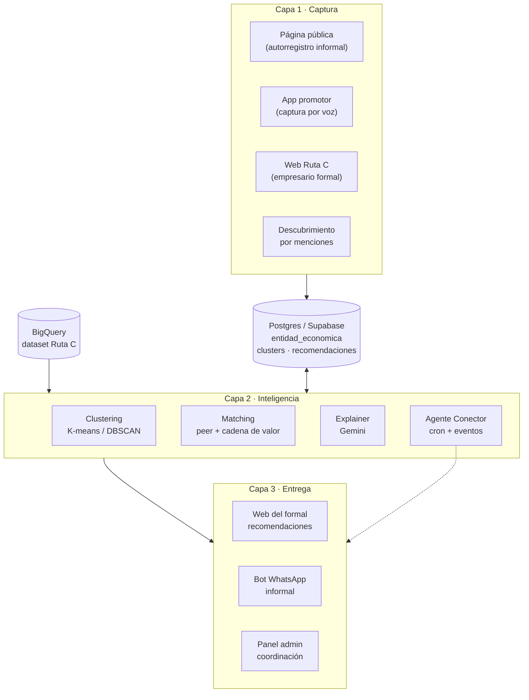

# Documentación técnica · Ruta C Conecta

> Documento técnico requerido por el reto del Hackathon Samatech.
> Este archivo se completa progresivamente a medida que el sistema se construye.
> La planeación detallada vive en [`docs/planeacion/`](planeacion/).

---

## 1. Cómo funciona la solución

> _Por completar al cierre del hackathon — descripción del flujo end-to-end con datos reales._

### Flujo del empresario formal (web)

1. El empresario inicia sesión en la web de Ruta C Conecta.
2. La home le muestra **3 a 5 recomendaciones priorizadas** generadas por el motor: cada una con tipo de relación (`cliente potencial`, `proveedor`, `aliado estratégico`, `referente`), score y razón en lenguaje natural.
3. Puede filtrar por tipo de relación y abrir el detalle de cada recomendación.
4. Acciones disponibles por recomendación: **marcar conexión**, **guardar**, **simular contacto**.
5. La sección "Mi cluster" muestra empresas afines en mapa o grafo.

### Flujo del comerciante informal (WhatsApp)

1. El comerciante recibe un mensaje del bot oficial con una oportunidad concreta (cliente cercano, proveedor disponible, programa de la Cámara).
2. El mensaje incluye contexto verificable (distancia, sector, número de pares conectados).
3. El comerciante responde con uno de los botones interactivos: **me interesa**, **ahora no**, **cuéntame más**.
4. Si responde "me interesa", el sistema notifica al otro extremo y registra la conexión.

### Flujo del agente Conector

- **5:00 AM** (cron nocturno): recalcula clusters, genera recomendaciones nuevas, envía notificaciones.
- **Por evento**: cuando se registra un comerciante nuevo o cambia de etapa, dispara recomendaciones inmediatas.
- **Por priorización**: marca empresarios que necesitan intervención humana y los envía al panel admin.

### Flujo del panel administrativo

1. La coordinación de la Cámara entra al panel.
2. Ve métricas del día: conexiones generadas, clusters más activos, territorios subatendidos, empresarios priorizados por el agente.
3. Puede explorar cualquier cluster, ver la trazabilidad de cada recomendación y exportar reportes.

---

## 2. Stack tecnológico

> _Por confirmar al cierre del Día 2 — la decisión motor Python vs motor Node se documenta en [`docs/planeacion/04-arquitectura.md`](planeacion/04-arquitectura.md)._

### Frontend

- **Next.js 16** (App Router, React Compiler activado)
- **TypeScript 6** strict mode
- **Tailwind CSS 4** + design system propio
- **next-intl** para i18n
- **SWR** para data fetching client-side
- **Leaflet.js** o **D3.js** para visualización de clusters
- **Bun** como runtime de desarrollo

### Backend / API

- **NestJS** (TypeScript) en [`src/brain/`](../src/brain/) como BFF y orquestador
- **Supabase / Postgres** para persistencia de clusters, recomendaciones, conexiones y eventos
- **Zod** para validación de contratos

### Motor inteligente

- **Python 3.11** + **FastAPI** _(opción A — recomendada por el reto)_
  - **scikit-learn** para K-means, DBSCAN, clustering jerárquico, cosine similarity
  - **pandas / numpy** para feature engineering
  - **sentence-transformers** para embeddings semánticos locales
  - **NetworkX** para grafos de relaciones
- **NestJS** reusando [`src/brain/`](../src/brain/) _(opción B — un solo lenguaje)_
  - **@xenova/transformers** o llamadas directas a la API de embeddings de Vertex AI
  - Implementación propia de cosine similarity y K-means
- La decisión final se documenta en [`docs/planeacion/04-arquitectura.md`](planeacion/04-arquitectura.md).

### Inteligencia artificial

- **Google Vertex AI** — plataforma de modelos
- **Gemini 2.x Flash / Pro** — clasificación del tipo de relación y generación de explicaciones en lenguaje natural
- **text-embedding-gecko** (o equivalente local con `sentence-transformers`) — vectorización de perfiles textuales

### Canal WhatsApp

- **WhatsApp Business Cloud API** (Meta) para mensajería con comerciantes informales
- Plantillas de mensaje aprobadas para notificaciones outbound
- Webhooks de respuesta procesados por [`src/brain/`](../src/brain/)

### Infraestructura

- **Google Cloud Run** para desplegar el motor inteligente como servicio sin servidor
- **Google Cloud Scheduler** para el cron nocturno del agente Conector
- **Google Cloud Pub/Sub** para triggers por evento (registro de comerciante nuevo, cambio de etapa)
- **Vercel** para el frontend Next.js

### Calidad y procesos

- **Vitest 4** + **React Testing Library** para tests
- **ESLint 10** + **Prettier 3** para linting y formato
- **Husky** + **lint-staged** + **commitlint** para hooks de Git

---

## 3. Herramientas de terceros

| Herramienta                 | Para qué se usa                                                     | Estado      |
| --------------------------- | ------------------------------------------------------------------- | ----------- |
| **Google BigQuery**         | Fuente principal de datos del dataset Ruta C provisto por la Cámara | Por definir |
| **Vertex AI**               | Plataforma de IA — modelos administrados                            | Por definir |
| **Gemini Flash / Pro**      | Clasificación de tipo de relación y generación de explicaciones     | Por definir |
| **text-embedding-gecko**    | Embeddings semánticos de perfiles de empresa                        | Por definir |
| **WhatsApp Business Cloud** | Canal de entrega para comerciantes informales                       | Por definir |
| **Google Cloud Run**        | Hosting serverless del motor inteligente                            | Por definir |
| **Google Cloud Scheduler**  | Disparo del agente Conector cada noche                              | Por definir |
| **Google Cloud Pub/Sub**    | Triggers por evento dentro del agente Conector                      | Por definir |
| **Supabase**                | Postgres administrado + auth para web del formal                    | Por definir |
| **Vercel**                  | Hosting del frontend Next.js                                        | Por definir |
| **Looker Studio**           | Dashboard inicial de exploración de datos (entregado por la Cámara) | Insumo      |

---

## 4. Arquitectura

### Diagrama de alto nivel



### Las tres capas

- **Captura** — múltiples puertas de entrada para reducir fricción según alfabetización digital del usuario.
- **Inteligencia** — una sola lógica de matching que opera sobre la tabla unificada `entidad_economica` (formales e informales en el mismo modelo).
- **Entrega** — el canal correcto para cada persona: web, WhatsApp, app móvil, panel.

### Contratos REST principales

```http
GET  /api/recommendations?entity_id={id}&type={tipo}&limit=5
POST /api/connections    { from, to, status, source_recommendation_id }
GET  /api/clusters/{id}
POST /api/entities       { ... }   # registro de comerciante (formal o informal)
POST /api/agent/recompute              # disparo manual del agente
POST /api/webhooks/whatsapp            # callback de Meta
POST /api/webhooks/entity-registered   # Pub/Sub trigger
```

Detalle completo del modelo de datos, contratos y triggers en [`docs/planeacion/04-arquitectura.md`](planeacion/04-arquitectura.md).

---

## 5. Cómo correr el proyecto localmente

> _Por completar al cierre del Día 2 cuando el esqueleto del motor esté funcionando._

### Requisitos previos

- **Bun** 1.x (`curl -fsSL https://bun.sh/install | bash`)
- **Node.js** 22+
- **Python** 3.11+ (solo si se elige el motor en Python)
- **Docker** (opcional, para Postgres local)
- Credenciales de acceso a:
  - Supabase (URL + anon key + service role)
  - Vertex AI (cuenta de servicio)
  - WhatsApp Business Cloud (token + phone number ID)
  - BigQuery (cuenta de servicio con permisos sobre el dataset Ruta C)

### Instalación

```bash
# 1. Clonar e instalar dependencias del monorepo
git clone <repo-url>
cd silver-adventure
bun install

# 2. Configurar variables de entorno
cp .env.example .env
# Editar .env con las credenciales de cada servicio

# 3. (Si motor en Python) crear venv e instalar
cd src/brain
python -m venv .venv
source .venv/bin/activate
pip install -r requirements.txt
```

### Comandos principales

```bash
# Frontend
cd src/front
bun dev                 # http://localhost:3000

# Backend (NestJS)
cd src/brain
bun dev                 # http://localhost:4000

# Motor en Python (si aplica)
cd src/brain
uvicorn app.main:app --reload --port 8000

# Tests
bun test                # corre toda la suite
```

### Variables de entorno

| Variable                         | Descripción                                        |
| -------------------------------- | -------------------------------------------------- |
| `NEXT_PUBLIC_API_URL`            | URL del backend BFF                                |
| `SUPABASE_URL`                   | URL del proyecto Supabase                          |
| `SUPABASE_ANON_KEY`              | Anon key de Supabase                               |
| `SUPABASE_SERVICE_ROLE_KEY`      | Service role key de Supabase (solo server-side)    |
| `GOOGLE_APPLICATION_CREDENTIALS` | Ruta al JSON de cuenta de servicio de Google Cloud |
| `VERTEX_AI_PROJECT_ID`           | Project ID en Google Cloud                         |
| `VERTEX_AI_LOCATION`             | Región (ej. `us-central1`)                         |
| `WHATSAPP_TOKEN`                 | Token de Meta WhatsApp Business                    |
| `WHATSAPP_PHONE_NUMBER_ID`       | ID del número aprobado para envío                  |
| `BIGQUERY_DATASET`               | Nombre del dataset Ruta C                          |

### Datos de prueba

Mientras se obtiene acceso a BigQuery, el motor lee de los CSVs locales en [`docs/hackathon/DATA/`](hackathon/DATA/):

- `REGISTRADOS_SII.csv` — universo de empresas formales
- `CLUSTERS.csv` — clusters predefinidos por la Cámara (referencia)
- `CLUSTERS_POSIBLES_MIEMBROS_POR_ACTIVIDAD_PRINCIPAL_DATOS.csv` — empresas candidatas con cluster sugerido
- `CLUSTERS_ACTIVIDADESECONOMICAS.csv` — mapeo cluster → CIIU
- `CLUSTERS_SECTORES_SECCIONES_ACTIVIDADES.csv` — taxonomía sector → sección → actividad

Para informales se genera un dataset semilla en `seed/informales.json` con ~50 perfiles representativos del Magdalena (ver [`docs/planeacion/05-motor-recomendaciones.md`](planeacion/05-motor-recomendaciones.md)).
