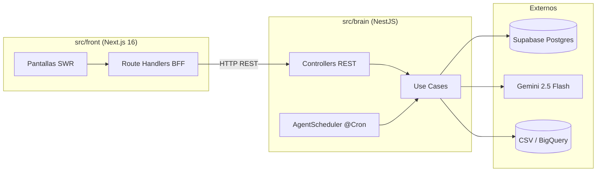

# Documentación técnica · Ruta C Conecta

> Documento técnico requerido por el reto del Hackathon Samatech (sección "Qué debe contener la documentación técnica" del [`README` del reto](hackathon/README.md)).
>
> Este archivo describe la **solución entregada**. Para la narrativa de producto y el "por qué" del enfoque ver el [README raíz](../README.md). Para el detalle por servicio ver [`src/front/README.md`](../src/front/README.md) y [`src/brain/README.md`](../src/brain/README.md). Para los specs de cada bounded context ver [`docs/specs/`](specs/).

---

## 1. Cómo funciona la solución

Ruta C Conecta es un sistema en tres capas: **captura → inteligencia → entrega**. Implementado como un monorepo Bun con dos servicios HTTP independientes que se comunican vía REST.

```
┌─────────────────────────────────────────────────────────────┐
│  CAPTURA          │   INTELIGENCIA       │   ENTREGA        │
├───────────────────┼──────────────────────┼──────────────────┤
│  src/front (Next) │   src/brain (Nest)   │  src/front (Next)│
│  Landing pública  │   Clusters           │  App autenticada │
│  Wizard registro  │   Recomendaciones    │  5 pantallas     │
│  Onboarding API   │   Agente Conector    │  SWR + polling   │
└───────────────────┴──────────────────────┴──────────────────┘
                          ▲
                          │ ports & adapters
                          ▼
                 ┌───────────────────┐
                 │  Supabase (PG)    │  ← persistencia
                 │  Gemini 2.5 Flash │  ← inferencia + texto
                 │  CSV (BQ-ready)   │  ← fuente de empresas
                 └───────────────────┘
```

### 1.1. Flujo end-to-end de un scan del agente

El componente agéntico exigido por el reto vive en `src/brain/src/agent/`. Su `AgentScheduler` corre un cron (default cada 60s; configurable vía `AGENT_CRON_SCHEDULE`) y ejecuta `RunIncrementalScan`:

1. **Crea `ScanRun`** con `trigger: 'cron'` y lo persiste en la tabla `scan_runs`.
2. **Calcula la ventana incremental** `since = lastCompletedRun?.completedAt ?? new Date(0)`.
3. **Sincroniza empresas** desde `CompanySource` (port). Hoy `CsvCompanySource` lee `docs/hackathon/DATA/REGISTRADOS_SII.csv`. El día que lleguen las credenciales BigQuery del reto se sustituye por `BigQueryCompanySource` cambiando una sola línea en `companies.module.ts`.
4. **Snapshot del estado anterior** — claves de recomendaciones y memberships de clusters (para el diff posterior).
5. **Regenera clusters** vía `GenerateClusters.execute()`:
   - **Capa A — Predefinidos**: 8 clusters estratégicos de la Cámara (BANANO, MANGO, YUCA, CACAO, PALMA, CAFÉ, LOGÍSTICA, TURISMO) asignados por mapping `cluster_ciiu_mapping`.
   - **Capa B — Heurísticos en cascada**:
     - Pase 1: `(ciiu_division, municipio)` con umbral ≥ 5 empresas.
     - Pase 2: `(ciiu_grupo, municipio)` con umbral ≥ 10 empresas.
   - Una empresa puede estar en N clusters al mismo tiempo (relación N:M en `cluster_members`).
6. **Regenera recomendaciones** vía `GenerateRecommendations.execute()` — estrategia AI-first con tres fallbacks (ver §1.2).
7. **Detecta oportunidades** comparando snapshot previo vs. nuevo:
   - `new_high_score_match` — recomendación con `score ≥ 0.8` que no existía antes.
   - `new_value_chain_partner` — recomendación de tipo `cliente` o `proveedor` nueva.
   - `new_cluster_member` — empresa que entró a un cluster en el que no estaba.
8. **Persiste eventos** en `agent_events` (consumibles por el front vía `GET /api/agent/events`).
9. **Marca `ScanRun.complete(stats)`** con totales.

Concurrencia: si un scan está corriendo, el siguiente tick lo skippea. `AGENT_ENABLED='false'` apaga el cron sin tocar código. Trigger manual vía `POST /api/agent/scan` para demos.

### 1.2. Cómo se generan las recomendaciones — AI primero

Cada recomendación tiene cuatro campos no negociables:

| Campo          | Tipo                                                          | Notas                                            |
| -------------- | ------------------------------------------------------------- | ------------------------------------------------ |
| `relationType` | `'referente' \| 'cliente' \| 'proveedor' \| 'aliado'`         | Cerrado en compile-time                          |
| `score`        | número en `[0, 1]`                                            | Validado en el factory `Recommendation.create()` |
| `reasons[]`    | JSONB estructurado `{ feature, weight, value?, confidence? }` | No texto libre                                   |
| `source`       | `'ai-inferred' \| 'cosine' \| 'rule' \| 'ecosystem'`          | Quién la generó                                  |

**Estrategia en cascada (en orden):**

1. **AI (PRINCIPAL)** — `AiMatchEngine` con Gemini. Para cada par `(ciiu_origen, ciiu_destino)` Gemini decide si hay relación de negocio, qué tipo y con qué confianza. Resultado cacheado en `ai_match_cache`.
2. **Fallback 1 — `PeerMatcher`** (cosine similarity sobre feature vectors) → recs de tipo `referente` con `cosine ≥ 0.7`.
3. **Fallback 2 — `ValueChainMatcher`** (24 reglas hardcoded de cadena de valor de la Cámara) → recs de tipo `cliente` o `proveedor`.
4. **Fallback 3 — `AllianceMatcher`** (6 ecosistemas predefinidos) → recs de tipo `aliado`.

**Fórmula del scoring (matcher AI):**

```
score = ai_confidence × (0.6 + 0.4 × proximity)
```

- `ai_confidence ∈ [0, 1]` — lo que devuelve Gemini para el par CIIU.
- `proximity ∈ [0, 1]` — calculado por `ProximityCalculator`:
  - 40% mismo municipio
  - 30% misma etapa de crecimiento (con bonus parcial para etapas adyacentes)
  - 30% similitud log-scale de tamaño (`personal × ingreso`)

El 60% del score es semántico (lo que la AI dice del par CIIU). El 40% modula por proximidad. Garantía: dos targets nunca empatan al azar.

**Dedupe.** Si AI y un fallback (o dos fallbacks) generan la misma terna `(source, target, type)`, gana la rec con mayor score. Las `reasons` son las del matcher ganador, no se mergean.

> Detalle completo del scoring (cada peso, cada threshold, ejemplos numéricos, divergencias con el spec) en [`docs/scoring.md`](scoring.md).

### 1.3. Lazy enrichment — explicaciones en lenguaje natural

Cuando un usuario hace click en una recomendación en el front, el use case `ExplainRecommendation` ejecuta:

1. Si `recommendation.explanation != null` → devolver el cached.
2. Sino → invocar Gemini con contexto (`source`, `target`, `relationType`, `reasons`) → texto natural.
3. Persistir en `recommendations.explanation` y `explanation_cached_at`.
4. Devolver el texto.

**Lazy** porque generar 10k explicaciones por scan sería caro. **Cached** porque una vez generada, no cambia mientras la rec exista.

### 1.4. Flujo del empresario formal (web)

1. El empresario inicia sesión en la web (`src/front`, Next.js 16).
2. La home (`/app/inicio`) muestra KPIs del día, hero del agente Conector, mini-cluster, timeline de actividad y quick actions.
3. `/app/recomendaciones` lista recomendaciones priorizadas con tabla, filtros por tipo de relación, drawer de detalle y pills de tipo/estado.
4. `/app/mi-cluster` muestra el cluster del usuario, miembros (cards), traits y cadenas de valor.
5. `/app/mi-negocio` permite ver el perfil de la empresa con tabs (general, productos, programas, visibilidad).
6. `/app/conexiones` lista conexiones realizadas/aceptadas con stats y filtros por estado.

Las pantallas consumen al brain a través de Route Handlers locales del front (`src/front/app/api/...`) que actúan de proxy/composition root y nunca exponen la URL del brain al cliente.

### 1.5. Flujo del registro asistido / onboarding

`POST /api/companies/onboard` (en el brain) recibe un payload mínimo, lo valida, deriva los campos faltantes (CIIU sanitizado, división, grupo, sección, etapa de crecimiento) y persiste la empresa. Esto habilita que el front tenga una pantalla de wizard guiado sin que el cliente arme el payload completo.

---

## 2. Stack tecnológico

### 2.1. Estructura del monorepo

Bun workspaces con dos servicios independientes:

```
silver-adventure/
├── src/
│   ├── front/      # Web Next.js 16 (App Router) — "captura" + "entrega"
│   └── brain/      # Servicio NestJS — "inteligencia"
├── docs/           # Documentación funcional, planeación y specs
├── supabase/       # Schema y migraciones de la base
└── .env            # Single source of truth (symlinks por workspace)
```

### 2.2. Stack global

| Capa       | Tecnología                                                                           |
| ---------- | ------------------------------------------------------------------------------------ |
| Runtime    | **Bun** 1.x para dev y scripts; Node 24 LTS para prod                                |
| Lenguaje   | **TypeScript 6** strict mode en ambos workspaces                                     |
| Front      | **Next.js 16.2** (App Router, React 19 + React Compiler), Tailwind 4, next-intl, SWR |
| Brain      | **NestJS 11**, `@nestjs/schedule` (cron), `@nestjs/swagger` (OpenAPI), Zod           |
| Datos      | **Supabase / Postgres** (cloud)                                                      |
| IA         | **Google Gemini 2.5 Flash** (chat + structured output) y `text-embedding-004`        |
| Validación | **Zod 4** en front, brain y env vars (fail-fast en startup)                          |
| Tests      | **Vitest 4** en ambos workspaces (RED → GREEN → REFACTOR estricto)                   |
| Calidad    | ESLint 10, Prettier 3, Husky + lint-staged + commitlint, conventional commits        |

### 2.3. Front (`src/front`)

| Bloque        | Pieza                                           |
| ------------- | ----------------------------------------------- |
| Framework     | `next` 16.2.4 (App Router + React Compiler)     |
| UI            | `react` 19.2, `tailwindcss` 4, `lucide-react`   |
| Animación     | `motion`                                        |
| Data fetching | `swr` + `axios` (singleton con interceptors)    |
| i18n          | `next-intl` 4.x (locales `es` default, `en`)    |
| Theme         | `next-themes` (light/dark/system)               |
| Supabase      | `@supabase/ssr`, `@supabase/supabase-js`        |
| Validación    | `zod` 4 (env + schemas del wizard)              |
| Tests         | `vitest` 4 + `@testing-library/react` + `jsdom` |

### 2.4. Brain (`src/brain`)

| Bloque     | Pieza                                                        |
| ---------- | ------------------------------------------------------------ |
| Framework  | `@nestjs/common`, `@nestjs/core`, `@nestjs/platform-express` |
| Cron       | `@nestjs/schedule` para el `AgentScheduler`                  |
| OpenAPI    | `@nestjs/swagger` (docs en `/docs`)                          |
| IA         | `@google/generative-ai` + adapter alternativo OpenRouter     |
| BD         | `@supabase/postgrest-js` (cliente liviano server-only)       |
| CSV        | `papaparse` (parsing del dataset Ruta C)                     |
| Validación | `zod`, `class-validator`, `class-transformer`                |
| Tests      | `vitest`, `@vitest/coverage-v8`, `supertest` (>80% coverage) |

---

## 3. Herramientas de terceros

| Herramienta                 | Para qué se usa                                                                               | Estado en el MVP                                                              |
| --------------------------- | --------------------------------------------------------------------------------------------- | ----------------------------------------------------------------------------- |
| **Supabase / Postgres**     | Persistencia de empresas, clusters, recomendaciones, eventos del agente, cache estructural AI | Integrado y operativo                                                         |
| **Google Gemini 2.5 Flash** | Matcher principal (par CIIU → relación + confianza) y generación de explicaciones lazy        | Integrado y operativo                                                         |
| **`text-embedding-004`**    | Modelo de embeddings de Gemini (uso futuro para enriquecer perfiles)                          | Configurado, no usado en runtime aún                                          |
| **OpenRouter**              | Adapter alternativo del `LlmPort` (hot-swap de modelo sin tocar código de dominio)            | Adapter implementado, switch vía `LLM_PROVIDER`                               |
| **Google BigQuery**         | Fuente principal de empresas — el reto promete credenciales en sobre cerrado al inicio        | **BigQuery-ready** vía port `CompanySource`. Hoy lee CSV; switch en una línea |
| **Vercel**                  | Hosting del front Next.js                                                                     | Proyecto linkeado                                                             |
| **Looker Studio**           | Dashboard de exploración entregado por la Cámara como insumo                                  | Insumo (no se modifica)                                                       |

> El stack del reto sugería Vertex AI + Cloud Run + FastAPI + Pub/Sub. Decidimos consolidar en Gemini directo + NestJS + Supabase porque (1) el reto permite "cualquier lenguaje, framework o herramienta open source", (2) ahorra ~3 servicios cloud sin perder ninguna capacidad funcional, y (3) la BFF discipline + el port `CompanySource` mantiene la solución integrable con Laravel vía REST cuando la Cámara la conecte a su backend existente.

---

## 4. Arquitectura

### 4.1. Hexagonal estricta (Ports & Adapters) en ambos workspaces

```
infrastructure → application → domain
```

Cada bounded context tiene tres capas:

| Capa              | Qué vive                                                          | Qué puede importar            |
| ----------------- | ----------------------------------------------------------------- | ----------------------------- |
| `domain/`         | Entities, value objects, ports (interfaces), domain services      | NADA externo. TypeScript puro |
| `application/`    | Use cases, application services                                   | Solo `domain/`                |
| `infrastructure/` | Adapters (Supabase, Gemini, CSV), controllers, modules, scheduler | `domain/` + `application/`    |

Los `*.module.ts` de NestJS son **el composition root** del brain — el único lugar donde se cablea qué adapter implementa qué port. Los Route Handlers del front (`src/front/app/api/*/route.ts`) son el composition root del front.

### 4.2. Diagrama de alto nivel



**Comunicación entre los dos servicios.** El front NUNCA habla con Supabase ni con Gemini directamente. Sus Route Handlers consumen al brain por REST. Esto preserva el patrón **BFF estricto** y permite que el brain se reemplace sin tocar UI.

### 4.3. Bounded contexts del brain

Seis contextos, cada uno con su propia carpeta `domain / application / infrastructure` y su propio `*.module.ts`:

```
src/brain/src/
├── shared/             # Logger, LlmPort, SupabaseClient, env, CsvLoader, DataPaths
├── ciiu-taxonomy/      # Taxonomía oficial DIAN CIIU rev 4
├── companies/          # Empresas + CompanySource port (BQ-ready)
├── clusters/           # Predefinidos + heurísticos en cascada
├── recommendations/    # AI-first: AiMatchEngine + 3 fallbacks + cache + scoring + lazy explain
└── agent/              # ScanRun, AgentEvent, OpportunityDetector, AgentScheduler @Cron
```

Specs detallados por contexto en [`docs/specs/`](specs/).

### 4.4. Persistencia — Supabase

| Bounded context   | Tablas                                                |
| ----------------- | ----------------------------------------------------- |
| `ciiu-taxonomy`   | `ciiu_taxonomy`                                       |
| `companies`       | `companies`                                           |
| `clusters`        | `clusters`, `cluster_members`, `cluster_ciiu_mapping` |
| `recommendations` | `recommendations`, `ai_match_cache`                   |
| `agent`           | `scan_runs`, `agent_events`                           |

Tipos auto-generados via `bun --filter front supabase:types`. El brain lee el archivo de tipos vía symlink.

### 4.5. Endpoints REST del brain

OpenAPI auto-generado disponible en `http://localhost:3001/docs` cuando el server está arriba. Todas las rutas tienen prefix global `/api`.

#### Health

- `GET /api/health` — health check.

#### Companies

- `GET /api/companies` — lista paginable (`?limit=N`).
- `GET /api/companies/:id` — detalle (404 si no existe).
- `POST /api/companies/onboard` — registro asistido (deriva CIIU, división, etapa).
- `GET /api/companies/:id/clusters` — clusters de una empresa.
- `GET /api/companies/:id/recommendations` — recs ordenadas por score (`?type=...&limit=...`).
- `GET /api/companies/:id/recommendations/grouped` — recs agrupadas por tipo de relación.

#### Clusters

- `POST /api/clusters/generate` — dispara `GenerateClusters` (admin / demo).
- `GET /api/clusters/:id/explain` — explicación en lenguaje natural del cluster.

#### Recommendations

- `POST /api/recommendations/generate` — dispara `GenerateRecommendations` (admin / demo). Body: `{ "enableAi": true | false }`.
- `POST /api/recommendations/:id/explain` — texto natural lazy + cached.

#### Agent

- `POST /api/agent/scan` — fuerza un `RunIncrementalScan({ trigger: 'manual' })`.
- `GET /api/agent/status` — estado del agente y últimos runs.
- `GET /api/agent/events?companyId=...&unread=true` — eventos para el usuario.
- `POST /api/agent/events/:id/read` — marca como leído.

> Colección Postman / Insomnia importable en [`docs/postman/`](postman/) con todas las rutas, variables y bodies de ejemplo.

### 4.6. BigQuery-readiness

El reto promete acceso a BigQuery con el dataset real, "en sobre cerrado al inicio del hackathon". Hoy trabajamos con el CSV `REGISTRADOS_SII.csv` como mock.

El port `CompanySource` permite que el día que lleguen las creds, el switch sea esta sola línea en `companies.module.ts`:

```ts
{ provide: COMPANY_SOURCE, useClass: CsvCompanySource }      // hoy
{ provide: COMPANY_SOURCE, useClass: BigQueryCompanySource } // mañana
```

Cero impacto en domain, use cases, agent, recommendations, clusters.

### 4.7. Decisiones arquitectónicas

Las decisiones cross-cutting están versionadas como ARQ-001 a ARQ-010 en [`docs/specs/00-arquitectura.md`](specs/00-arquitectura.md). Las más relevantes:

- **ARQ-001** — Hexagonal estricta como contrato no negociable.
- **ARQ-005** — Heurísticos de clusters en cascada de 2 niveles (división MIN=5, grupo MIN=10).
- **ARQ-007** — TDD obligatorio (RED → GREEN → REFACTOR), coverage > 80% en `src/`.
- **ARQ-010** — Single source of truth de `.env` + symlinks por workspace.

---

## 5. Despliegues en vivo

El sistema está desplegado y disponible públicamente para que el jurado pueda probarlo sin clonar el repo.

| Servicio             | URL                                                                  | Hosting                             |
| -------------------- | -------------------------------------------------------------------- | ----------------------------------- |
| **Front (Next.js)**  | https://silver-adventure-ecru.vercel.app/                            | Vercel                              |
| **Brain (NestJS)**   | https://silver-adventure-9f6p.onrender.com                           | Render (free tier)                  |
| Health check         | https://silver-adventure-9f6p.onrender.com/api/health                | —                                   |
| OpenAPI / Swagger    | https://silver-adventure-9f6p.onrender.com/docs                      | Auto-generado por `@nestjs/swagger` |
| Presentación (Canva) | https://www.canva.com/design/DAHH-MPDRUw/qlkiz3qZdDTMThPTEIY8aw/view | Canva                               |
| Presentación (PDF)   | [`presentacion/presentacion.pdf`](../presentacion/presentacion.pdf)  | Repo                                |

> ⚠️ **Importante para la evaluación.** El brain está en el plan gratuito de Render: si pasan más de 15 minutos sin tráfico, el contenedor se duerme y el primer request tarda **30–60 segundos** en despertar. Cargar primero el health check y esperar el `200 OK` antes de probar la web.

### Probar la API en vivo

```bash
# Health check (despierta el contenedor)
curl https://silver-adventure-9f6p.onrender.com/api/health

# Listar empresas
curl 'https://silver-adventure-9f6p.onrender.com/api/companies?limit=10'

# Ver eventos del agente para una empresa
curl 'https://silver-adventure-9f6p.onrender.com/api/agent/events?companyId=<ID>'
```

O importar la colección Postman desde [`docs/postman/`](postman/) y cambiar la variable `baseUrl` a `https://silver-adventure-9f6p.onrender.com/api`.

---

## 6. Cómo correr el proyecto localmente

### 6.1. Requisitos previos

- **Bun** 1.x (`curl -fsSL https://bun.sh/install | bash`)
- **Node.js** 22+ (Bun lo necesita para algunas tools)
- Credenciales:
  - Supabase (URL + publishable key + service role key)
  - Google Gemini API key (desde Google AI Studio)

### 6.2. Instalación

```bash
# 1. Clonar e instalar dependencias del monorepo
git clone <repo-url>
cd silver-adventure
bun install

# 2. Configurar variables de entorno
cp .env.example .env
# Editar .env con SUPABASE_*, GEMINI_API_KEY, etc.
# (los workspaces ven el .env vía symlinks relativos)

# 3. Generar tipos de Supabase (opcional, ya commiteados)
bun --filter front supabase:types
```

### 6.3. Seed inicial — cargar datos

Los seeds son scripts independientes que llaman use cases reales (no duplican lógica de mapeo) y son **idempotentes** (upsert por id):

```bash
# Bootstrap todo en orden correcto
bun --filter brain seed

# O paso a paso
bun --filter brain seed:ciiu              # taxonomía DIAN (CIIU_DIAN.csv)
bun --filter brain seed:companies         # empresas (REGISTRADOS_SII.csv)
bun --filter brain seed:clusters          # 8 clusters predefinidos (CLUSTERS.csv)
bun --filter brain seed:cluster-mappings  # mapeo cluster → CIIU
```

> **Nota costo IA.** Después de seedear, el primer arranque del agente disparará `CiiuPairEvaluator.evaluateAll()`, que llena `ai_match_cache` con ~25k pares (~$1–3 USD con `gemini-2.5-flash`). Las siguientes corridas son casi gratis. Para evitarlo en CI / E2E → `AI_MATCH_INFERENCE_ENABLED=false`.

### 6.4. Levantar los servicios

```bash
# Desde la raíz, en terminales separadas:
bun dev:front        # http://localhost:3000  (Next.js)
bun dev:brain        # http://localhost:3001  (NestJS, OpenAPI en /docs)

# O filtrando manualmente:
bun --filter front dev
bun --filter brain start:dev
```

### 6.5. Tests

```bash
bun test                            # corre vitest en front y brain
bun --filter brain test:run         # solo brain
bun --filter front test:run         # solo front
bun --filter brain test:coverage    # coverage report
```

Pre-push hook corre `bun test` automáticamente. Si falla algún test, el push se rechaza.

### 6.6. Format y lint

```bash
bun lint              # ESLint en ambos workspaces
bun format            # Prettier en todo el repo
bun format:check      # CI mode (sin escribir)
```

### 6.7. Variables de entorno

Hay **un solo `.env` real** en la raíz del monorepo. Cada workspace lo ve a través de un **symlink relativo** (`src/front/.env -> ../../.env`, idem brain). El archivo es shared, pero cada workspace declara qué variables consume vía Zod schema independiente, que falla rápido al startup si falta algo. Detalle en [`AGENTS.md`](../AGENTS.md) §8.

| Categoría     | Variables principales                                                                           |
| ------------- | ----------------------------------------------------------------------------------------------- |
| Supabase      | `SUPABASE_URL`, `SUPABASE_PUBLISHABLE_KEY`, `SUPABASE_SERVICE_ROLE_KEY`                         |
| Gemini        | `GEMINI_API_KEY`, `GEMINI_CHAT_MODEL` (default `gemini-2.5-flash`), `GEMINI_EMBEDDING_MODEL`    |
| LLM provider  | `LLM_PROVIDER` (`gemini` \| `openrouter`), `OPENROUTER_API_KEY`                                 |
| Agente        | `AGENT_CRON_SCHEDULE` (default `*/60 * * * * *`), `AGENT_ENABLED`, `AI_MATCH_INFERENCE_ENABLED` |
| GCP / BQ      | `GCP_PROJECT_ID`, `GCP_LOCATION`, `BIGQUERY_DATASET` (uso futuro)                               |
| Front público | `NEXT_PUBLIC_APP_URL`, `NEXT_PUBLIC_DEBUG_ENABLED`                                              |
| Debug         | `DEBUG_ENABLED` (server)                                                                        |

Plantilla completa en [`.env.example`](../.env.example).

### 6.8. Datos de prueba incluidos

El dataset de la Cámara entregado con el reto vive en [`docs/hackathon/DATA/`](hackathon/DATA/):

- `CIIU_DIAN.csv` — taxonomía oficial CIIU rev 4 de la DIAN.
- `REGISTRADOS_SII.csv` — universo de empresas registradas.
- `CLUSTERS.csv` — 8 clusters predefinidos por la Cámara.
- `CLUSTERS_ACTIVIDADESECONOMICAS.csv` — mapeo cluster → CIIU.
- `CLUSTERS_POSIBLES_MIEMBROS_POR_ACTIVIDAD_PRINCIPAL_DATOS.csv` — empresas candidatas con cluster sugerido.
- `CLUSTERS_SECTORES_SECCIONES_ACTIVIDADES.csv` — taxonomía sector → sección → actividad.

### 6.9. Probar la API rápido

```bash
# Health check
curl http://localhost:3001/api/health

# Listar empresas
curl 'http://localhost:3001/api/companies?limit=10'

# Generar clusters (sin AI, rápido)
curl -X POST http://localhost:3001/api/clusters/generate

# Generar recomendaciones SIN AI (usa solo fallbacks heurísticos)
curl -X POST http://localhost:3001/api/recommendations/generate \
  -H 'Content-Type: application/json' \
  -d '{"enableAi": false}'

# Disparar scan manual del agente
curl -X POST http://localhost:3001/api/agent/scan

# Ver eventos generados por el agente
curl 'http://localhost:3001/api/agent/events?companyId=<ID>'
```

O importar la colección Postman desde [`docs/postman/`](postman/).

---

## 7. Roadmap pos-hackathon

Lo siguiente NO está en el MVP entregado pero sí está diseñado y documentado para la siguiente iteración:

- **Switch a BigQuery real** cuando lleguen credenciales — un PR mínimo en `companies.module.ts` (port ya existe).
- **Canal WhatsApp Business Cloud API** para comerciantes informales — diseñado en [`docs/planeacion/03-personas-y-canales.md`](planeacion/03-personas-y-canales.md).
- **App móvil para promotores de la Cámara** con captura por voz — diseñada en la misma planeación.
- **Panel administrativo extendido** con métricas de impacto y trazabilidad de decisiones del modelo.
- **Embeddings semánticos** del perfil textual (modelo ya configurado, integración pendiente).

---

## 8. Referencias

- [`README.md`](../README.md) — narrativa de producto, problema, solución, equipo.
- [`AGENTS.md`](../AGENTS.md) — convenciones del repo, BFF, hooks, path aliases, env strategy.
- [`src/front/README.md`](../src/front/README.md) — detalle del front (pantallas, providers, hooks).
- [`src/brain/README.md`](../src/brain/README.md) — detalle del brain (motor IA, agente, clusters).
- [`docs/scoring.md`](scoring.md) — sistema de scoring (fórmulas, pesos, thresholds).
- [`docs/specs/`](specs/) — specs por bounded context (requirements + scenarios).
- [`docs/postman/`](postman/) — colección Postman v2.1 con todas las rutas.
- [`docs/hackathon/`](hackathon/) — bases del reto, dataset y documentación de clustering.
- OpenAPI live: `http://localhost:3001/docs` con el brain corriendo.
