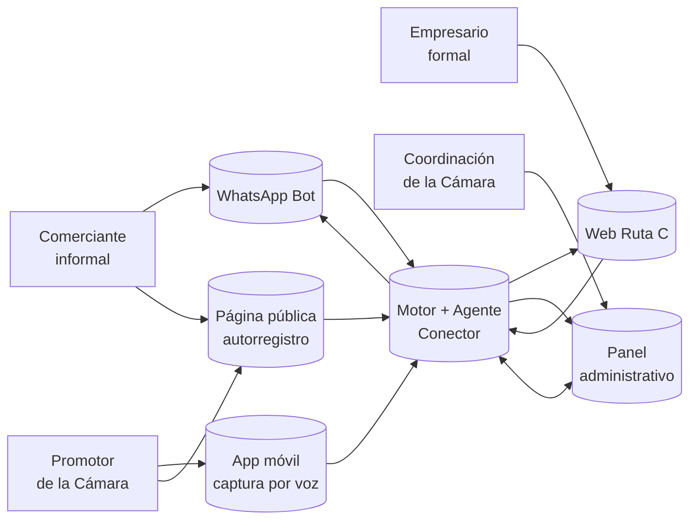

# 03 · Personas y canales

> Quiénes son, cómo entran, qué hacen y qué reciben.
> Una sola lógica de matching. Cuatro puertas distintas según alfabetización digital y rol.

---

## Mapa de personas y canales



**El beneficiario principal es el comerciante informal** porque es quien más valor extrae sin cambiar nada de su rutina diaria. Los otros tres son habilitadores y amplificadores de ese valor.

---

## 1. Comerciante informal — _la persona más importante del sistema_

### Quién es

> **Doña Marleny, 52 años.** Vende empanadas y jugos en un puesto fijo del Mercado del Magdalena hace 8 años. No tiene RUT, no se considera "empresaria". Atiende de 7 AM a 3 PM. Vive en Pescaíto, viene en mototaxi al mercado. Su única herramienta digital es WhatsApp — lo usa para coordinar con sus tres hijas, recibir pedidos del barrio y mandar audios.

Otros perfiles del mismo segmento:

- **Don Fabio**, pescador en Taganga con lancha propia. Vende a restaurantes informalmente.
- **Yenifer**, artesana en Bastidas. Hace mochilas tejidas. Vende en ferias y por WhatsApp.
- **Wilfran**, mototaxista en Pescaíto. Conoce todo el barrio y las rutas.
- **Marcela**, cocinera de almuerzos ejecutivos en su casa de Mamatoco. Empaca 30 almuerzos diarios.

### Cuál es su trabajo (job-to-be-done)

> "Quiero más clientes para vender más. Pero no tengo tiempo de andar buscando, no me sé las apps esas, y no me gustan los formularios."

### Cómo entra al sistema

**Canal primario: WhatsApp** (MVP demoable)

- No descarga nada.
- No se registra en ningún sitio web.
- No aprende nada nuevo.
- Recibe un mensaje del bot oficial de la Cámara con una oportunidad concreta.
- Responde con botones interactivos.

**Canal secundario: registro asistido por una promotora** (visible en pitch, mockeado en demo)

- Una promotora se le acerca con un celular.
- Graba un audio de 30 segundos describiendo el puesto.
- El sistema extrae los atributos automáticamente.
- En menos de un minuto, Doña Marleny existe en el sistema.

**Canal terciario: descubrimiento por menciones** (roadmap, no MVP)

- Si un empresario formal menciona a Doña Marleny en su diagnóstico ("compro las empanadas a una señora del mercado"), el sistema la propone como entidad descubierta.
- Una promotora la valida en campo.

### Flujo del MVP — paso a paso

| #   | Paso                                                                                 | Quién actúa | Detalle técnico                                                  |
| --- | ------------------------------------------------------------------------------------ | ----------- | ---------------------------------------------------------------- |
| 1   | Doña Marleny es registrada en el sistema (mockeado para demo)                        | Promotora   | Insert en `entidad_economica` con `origen = informal_registrado` |
| 2   | El agente Conector detecta el nuevo registro                                         | Sistema     | Trigger Pub/Sub o webhook interno                                |
| 3   | El motor calcula recomendaciones (oficinas cercanas que buscan opciones de almuerzo) | Sistema     | Cadena de valor: cocinera → oficina                              |
| 4   | El bot envía el mensaje outbound por WhatsApp                                        | Sistema     | WhatsApp Business Cloud API + plantilla aprobada                 |
| 5   | Doña Marleny recibe el mensaje en su WhatsApp                                        | Persona     | Mensaje + 3 botones interactivos                                 |
| 6   | Responde "me interesa"                                                               | Persona     | Webhook recibe la respuesta                                      |
| 7   | El sistema notifica al otro extremo (la oficina formal en la web)                    | Sistema     | Insert en `conexiones` + notificación al formal                  |
| 8   | El panel admin muestra la conexión generada en tiempo real                           | Sistema     | SWR refresca cada 30s o suscripción a Supabase realtime          |

### Qué información ve

- Mensaje del bot con: oportunidad concreta, contexto (a 4 cuadras, 3 oficinas, ya hablaron con dos cocineras parecidas), siguiente paso explícito.
- Botones: `me interesa` · `ahora no` · `cuéntame más`.
- Si responde "cuéntame más", recibe el contacto del otro extremo y puede iniciar la conversación.

### Qué acción puede tomar

- Aceptar la oportunidad → se registra la conexión.
- Rechazar → no recibe esa misma oportunidad de nuevo.
- Pedir más detalle → recibe contacto y puede coordinar directamente.

### Plantilla de mensaje WhatsApp (borrador)

```
Hola Doña Marleny, soy el bot de la Cámara de Comercio de Santa Marta.

Tres oficinas a 4 cuadras de su puesto en el mercado están buscando
opciones de almuerzo. Una de ellas estaría dispuesta a pedirle 12
almuerzos diarios.

Otras 2 cocineras parecidas a usted ya están conectadas con oficinas
así por este sistema.

¿Le interesa?

[ Sí, me interesa ] [ Cuénteme más ] [ Ahora no ]
```

### Riesgos específicos

- Que el mensaje no se reciba (limitación de WhatsApp Cloud API con números no verificados → plan B: usar el sandbox de Meta).
- Que la respuesta tarde y la demo no sea fluida → plan B: pre-escribir la respuesta antes del demo.
- Que el tono suene a spam → mitigación: validar plantilla con el equipo de UX antes de aprobar con Meta.

---

## 2. Empresario formal — _el que valida la inteligencia del sistema_

### Quién es

> **Carlos, 41 años.** Dueño de Hotel Boutique Las Camelias en El Rodadero, 18 habitaciones. Etapa de crecimiento. Está registrado en Ruta C desde 2024, llenó su diagnóstico una vez y no ha vuelto en 8 meses. Trabaja desde un escritorio, usa Gmail y Excel, conoce navegadores web. No usa apps de productividad complejas.

Otros perfiles:

- **Andrea**, propietaria de pastelería artesanal en Centro Histórico. Madurez.
- **Felipe**, fundador de agencia de turismo de naturaleza. Crecimiento.
- **Patricia**, dueña de tienda de ropa en Bavaria. Crecimiento.

### Cuál es su trabajo

> "Quiero que mi negocio crezca, encontrar buenos proveedores locales, conseguir aliados, y no tener que recorrer media ciudad pidiendo recomendaciones a otros dueños."

### Cómo entra al sistema

**Canal único: web de escritorio.**

- Login con su cuenta existente de Ruta C (single sign-on con Supabase).
- Ve el home con sus recomendaciones.

### Flujo del MVP — paso a paso

| #   | Paso                                                                                           | Quién actúa | Detalle técnico                         |
| --- | ---------------------------------------------------------------------------------------------- | ----------- | --------------------------------------- |
| 1   | Carlos hace login en la web                                                                    | Persona     | Supabase auth                           |
| 2   | El home llama `GET /api/recommendations?entity_id=carlos_hotel`                                | Sistema     | Devuelve top-5 con score + razón + tipo |
| 3   | Carlos ve 3 recomendaciones nuevas en cards                                                    | Persona     | Render con SWR                          |
| 4   | Hace clic en "Cooperativa de pescadores en Taganga"                                            | Persona     | Navega a `/recommendations/{id}`        |
| 5   | Ve el detalle: anclas verificables, otras hoteles parecidos que ya conectaron, botón de acción | Persona     | Componente de detalle                   |
| 6   | Clic en "Simular contacto" → modal con plantilla de mensaje                                    | Persona     | Estado local                            |
| 7   | Confirma → se registra la conexión y se notifica al otro extremo                               | Sistema     | `POST /api/connections`                 |
| 8   | Vuelve al home y ve que la recomendación está marcada como "contactada"                        | Persona     | SWR revalida                            |

### Qué información ve

**Card de recomendación:**

- Nombre del otro empresario / cooperativa
- Tipo de relación (`cliente potencial`, `proveedor`, `aliado`, `referente`)
- Score (visual: barra o estrellas, no número técnico)
- Razón en 1–2 líneas
- Acción primaria

**Detalle:**

- Foto + descripción del otro extremo
- Las **anclas verificables** completas: distancia, programa compartido, sector compatible, pares similares conectados
- Los datos de contacto (al confirmar acción)
- Botones: `marcar conexión` · `guardar` · `simular contacto`

### Qué acción puede tomar

- **Marcar conexión**: confirma que ya conoce o conectó con esa empresa.
- **Guardar**: archiva la recomendación para revisarla después.
- **Simular contacto**: el sistema arma una plantilla de primer contacto editable.

### Riesgos específicos

- Que las recomendaciones suenen genéricas → mitigación: cada razón tiene mínimo 2 anclas verificables específicas.
- Que el detalle muestre datos sensibles del otro extremo → mitigación: solo mostrar contacto al confirmar acción.

---

## 3. Promotor de la Cámara — _narrado en demo, no construido_

### Quién es

> **Andrea, 28 años.** Asesora de la Cámara de Comercio de Santa Marta hace 3 años. Trabaja en territorio: visita mercados, ferias y barrios. Conoce a los comerciantes por nombre. Su trabajo era llenar formularios de 40 preguntas — ahora pasa 80% de su tiempo en eso y 20% conversando con la gente.

### Cuál es su trabajo

> "Necesito registrar a más comerciantes informales sin que el formulario se vuelva la barrera. Y necesito que el sistema me ayude a saber a quién atender primero."

### Cómo entra al sistema

**Canal: app móvil (visión, no MVP demoable).**

- Abre la app de la Cámara en su celular en campo.
- Captura por **foto + audio** (30 segundos).
- El sistema transcribe, extrae atributos, propone perfil estructurado.
- Andrea revisa y confirma en 30 segundos.

### Flujo del MVP — narrado, con mock

Para el demo, mostramos:

1. Captura de pantalla del flujo de la app (mock estático).
2. Audio pregrabado de Andrea describiendo el puesto de Doña Marleny.
3. Mock de cómo el sistema extrae los atributos.
4. Inserción en la base de datos como si fuera real (en realidad seedeada).

**Esto se cuenta así en el demo:**

> _"Para el hackathon construimos la web del formal y el bot del informal end-to-end. La app del promotor es la siguiente capa: la diseñamos, hicimos los wireframes, y la integración con Whisper para extracción por voz está validada técnicamente. Lo que ven aquí es un mock realista del flujo."_

### Qué información ve (en la visión, no demoado)

- Lista de comerciantes asignados a su zona del día.
- Mapa con los puntos a visitar.
- Empresarios priorizados por el agente Conector que necesitan intervención humana.
- Botón grande de "+ Nuevo registro" → captura por voz.

---

## 4. Coordinación de la Cámara — _el panel de control_

### Quién es

> **Camila, 36 años.** Coordinadora del programa Ruta C en la Cámara de Comercio de Santa Marta. Reporta al gerente regional. Cada mes presenta a la junta cuántos empresarios están activos, cuántas conexiones se generaron, qué impacto tiene Ruta C en el territorio.

### Cuál es su trabajo

> "Necesito demostrar impacto del programa Ruta C, asignar el equipo de promotores donde más se necesita, y detectar oportunidades de inversión en territorios subatendidos."

### Cómo entra al sistema

**Canal: panel administrativo web.**

- Login con cuenta institucional.
- Vista de operación del día y vista de drill-down.

### Flujo del MVP — paso a paso

| #   | Paso                                                                                           | Quién actúa | Detalle técnico                         |
| --- | ---------------------------------------------------------------------------------------------- | ----------- | --------------------------------------- |
| 1   | Camila hace login al panel                                                                     | Persona     | Supabase auth con rol `admin`           |
| 2   | Ve el overview con métricas del día                                                            | Persona     | `GET /api/admin/dashboard`              |
| 3   | Identifica que Pescaíto tiene baja actividad y muchos informales sin conectar                  | Persona     | Mapa con heatmap                        |
| 4   | Hace clic en "Empresarios priorizados" y ve los 5 que el Conector marcó                        | Persona     | Lista con score de prioridad y motivo   |
| 5   | Selecciona uno y ve la trazabilidad: qué recomendaciones recibió, qué hizo, qué necesita ahora | Persona     | `GET /api/admin/entities/{id}/timeline` |
| 6   | Asigna ese empresario a una promotora (visión, no MVP)                                         | Persona     | Mock                                    |

### Qué información ve

**Overview:**

- Conexiones generadas hoy / esta semana / este mes
- Conexiones marcadas como exitosas (% conversión)
- Clusters más activos (cuáles están moviendo más conexiones)
- Mapa de territorios con heatmap de actividad
- Empresarios formales nuevos / informales nuevos
- Lista de empresarios priorizados por el Conector con score y razón

**Drill-down de un empresario:**

- Perfil completo
- Cluster al que pertenece y por qué
- Timeline de recomendaciones recibidas y acciones tomadas
- Conexiones registradas
- Anomalías detectadas por el agente

### Qué acción puede tomar

- Filtrar por territorio, sector, etapa.
- Exportar reporte (CSV o PDF).
- En la visión: asignar empresarios a promotores, lanzar campañas dirigidas, marcar conexiones para auditoría.

---

## Tabla resumen de canales y prioridad de demo

| Persona              | Canal             | Estado en MVP              | Prioridad demo |
| -------------------- | ----------------- | -------------------------- | -------------- |
| Comerciante informal | WhatsApp          | Construido end-to-end      | Crítico        |
| Empresario formal    | Web de escritorio | Construido end-to-end      | Crítico        |
| Coordinación         | Panel admin       | Construido (versión MVP)   | Alto           |
| Promotor             | App móvil con voz | Mockeado, narrado en pitch | Solo narración |

---

## Anti-patrón

> Diseñar 4 experiencias completas y entregar 4 a medias.
> Mejor 2 entregadas con calidad de demo + 2 narradas con honestidad. El jurado prefiere foco con honestidad que ambición a medias.

---

## Referencias cruzadas

- Alcance que define qué se construye → [`01-alcance-mvp.md`](01-alcance-mvp.md)
- Roles que ejecutan cada experiencia → [`02-roles-equipo.md`](02-roles-equipo.md)
- Arquitectura técnica de cada canal → [`04-arquitectura.md`](04-arquitectura.md)
- Cómo el motor decide qué recomendar a cada persona → [`05-motor-recomendaciones.md`](05-motor-recomendaciones.md)
