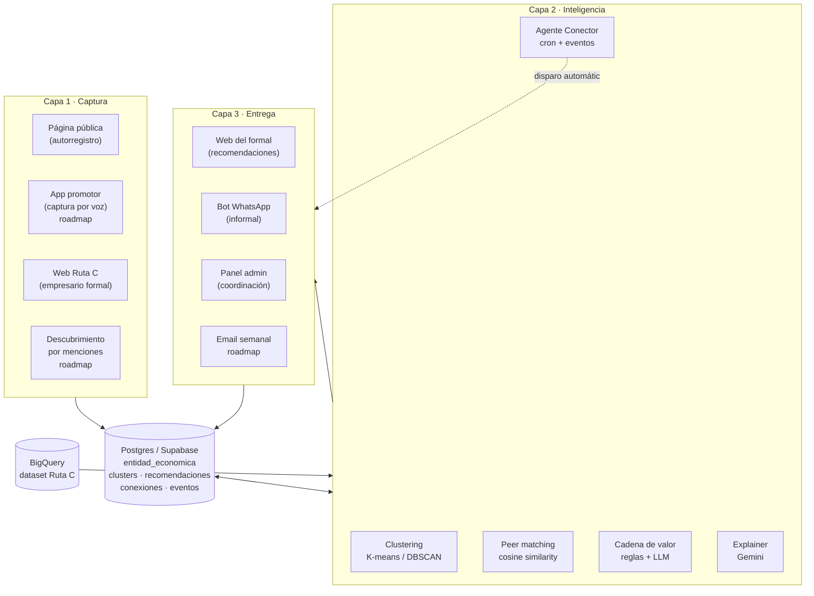
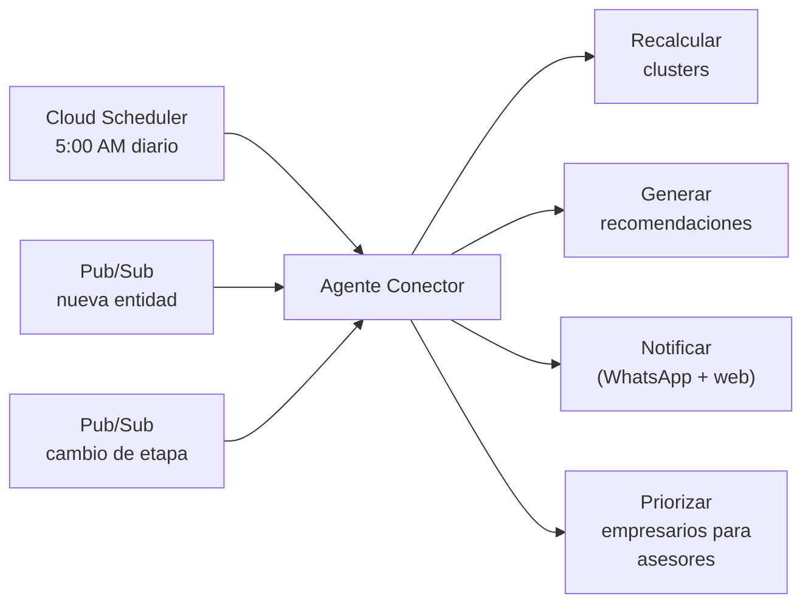
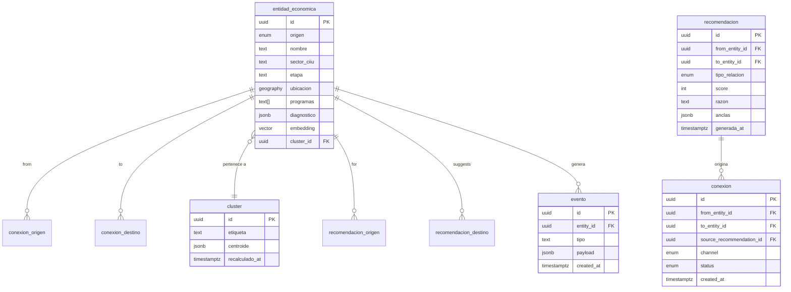
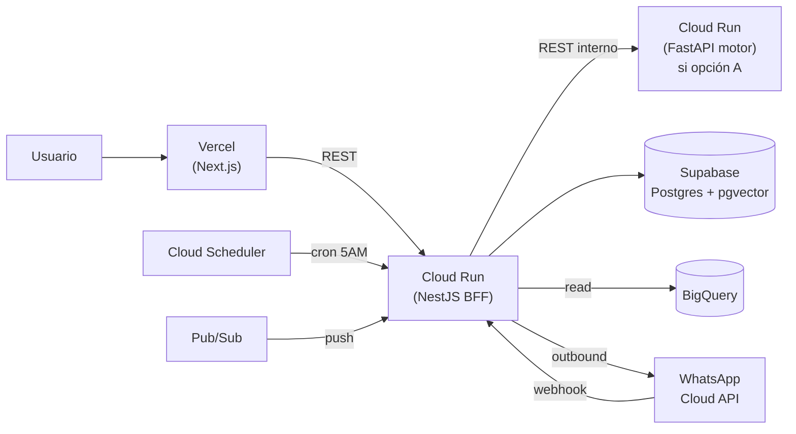

# 04 · Arquitectura

> Tres capas, una sola lógica de matching, un agente que conecta todo.
> Decisiones técnicas con su trade-off explícito. Si algo cambia, se actualiza acá primero.

---

## Vista general



---

## Capa 1 · Captura

### Propósito

Reducir fricción de entrada al sistema. La alfabetización digital del usuario decide la puerta.

### Componentes del MVP

| Puerta                       | Tecnología                                    | Persona                                       | Estado           |
| ---------------------------- | --------------------------------------------- | --------------------------------------------- | ---------------- |
| Web Ruta C                   | Next.js 16 ([`src/front/`](../../src/front/)) | Empresario formal                             | Construido       |
| Página pública               | Next.js 16 (mismo deploy, ruta pública)       | Comerciante informal con alfabetización media | MVP opcional     |
| App promotor                 | React Native / Expo                           | Promotor                                      | Roadmap, narrado |
| Descubrimiento por menciones | Job batch + NER en NestJS                     | (sistema)                                     | Roadmap          |

### Persistencia

Toda captura termina en la tabla unificada `entidad_economica` de Supabase/Postgres con un campo `origen` que distingue el modo de entrada.

```sql
-- Esquema simplificado (versión final en migración)
create type origen_entidad as enum (
  'formal',
  'informal_registrado',
  'informal_mencionado',
  'informal_autoregistrado'
);

create table entidad_economica (
  id              uuid primary key default gen_random_uuid(),
  origen          origen_entidad not null,
  nombre          text not null,
  descripcion     text,
  sector_ciiu     text,
  etapa           text,
  ubicacion       geography(point, 4326),
  municipio       text,
  barrio          text,
  programas       text[] default '{}',
  diagnostico     jsonb,
  contacto        jsonb,
  embedding       vector(768),
  cluster_id      uuid references cluster(id),
  created_at      timestamptz default now(),
  updated_at      timestamptz default now()
);

create index entidad_embedding_idx on entidad_economica
  using ivfflat (embedding vector_cosine_ops);
```

> **Nota**: `vector` requiere la extensión `pgvector` de Supabase. Si no se habilita a tiempo, plan B es calcular similitud en memoria desde el motor.

---

## Capa 2 · Inteligencia

### Propósito

Una sola lógica de matching que opera sobre `entidad_economica` sin distinguir si la entidad es formal o informal. La distinción solo importa en captura y entrega.

### Componentes

#### 2.1 Clustering dinámico

- **Algoritmo**: K-means para clusters generales, DBSCAN para detección por densidad geográfica.
- **Features**: ver [`05-motor-recomendaciones.md`](05-motor-recomendaciones.md).
- **Frecuencia**: recálculo nocturno por cron (Cloud Scheduler 5:00 AM).
- **Output**: tabla `cluster` con etiqueta humana, centroide y miembros.

#### 2.2 Peer matching (similitud)

- **Técnica**: cosine similarity sobre embeddings de perfil.
- **Cuándo aplica**: dos empresas del mismo sector y etapa similar → relación `referente` o `aliado`.
- **API**: `GET /api/recommendations?type=peer&entity_id={id}&limit=5`.

#### 2.3 Cadena de valor (complementariedad)

- **Técnica**: reglas heurísticas sector→sector + clasificador LLM (Gemini Flash) para validar contexto.
- **Cuándo aplica**: una empresa puede ser cliente o proveedor de otra → relación `cliente potencial` o `proveedor`.
- **API**: `GET /api/recommendations?type=value-chain&entity_id={id}&limit=5`.

#### 2.4 Explainer

- **Técnica**: Gemini Pro con prompt estructurado.
- **Input**: las anclas verificables (distancia, programa compartido, sector compatible, pares conectados).
- **Output**: 1–2 frases en español neutro con tono cálido.
- **Plantilla**:

```text
Te recomiendo a {nombre} porque:
- {ancla 1: relación geográfica/programa/sector}
- {ancla 2: pares conectados o validación social}
Sería un buen {tipo_relacion} para tu negocio.
```

#### 2.5 Agente Conector

El componente que vale el 25% de la nota. Detalle en [`05-motor-recomendaciones.md`](05-motor-recomendaciones.md).

**3 disparadores**:



---

## Capa 3 · Entrega

### Propósito

Cada persona recibe la información en el canal que ya usa, con la UX adecuada a su contexto.

### Componentes del MVP

| Canal          | Tecnología                                             | Persona              |
| -------------- | ------------------------------------------------------ | -------------------- |
| Web del formal | Next.js 16 + Tailwind 4 + SWR                          | Empresario formal    |
| Bot WhatsApp   | NestJS + WhatsApp Business Cloud API + plantillas Meta | Comerciante informal |
| Panel admin    | Next.js 16 (rutas `/admin/*`)                          | Coordinación         |
| Email semanal  | Resend / SendGrid + plantillas MJML                    | Roadmap              |

---

## Decisión clave: motor en Python vs reusar NestJS

**Trade-off documentado, decisión final al cierre del Día 1 (después del EDA).**

### Opción A · Motor en Python (FastAPI)

**Pros:**

- scikit-learn, pandas, sentence-transformers son nativos de Python — más rápido para clustering serio.
- Recomendación oficial del reto, jurado lo va a esperar.
- Más material de referencia (PDFs en [`docs/hackathon/DOCUMENTACION SOBRE CLUSTERS/`](../hackathon/DOCUMENTACION%20SOBRE%20CLUSTERS/)) para defender el enfoque en pitch.
- Data/ML trabaja en su lenguaje natural sin pasar handoff.

**Contras:**

- Dos lenguajes, dos despliegues, dos sets de tests.
- El frontend habla con NestJS (BFF) que llama a FastAPI internamente — un hop más.

**Estructura si se elige A:**

```
src/
  brain/                    ← NestJS (TypeScript)
    BFF, auth, WhatsApp webhook, agente trigger
  motor/                    ← FastAPI (Python)
    /clustering
    /matching
    /explainer
    requirements.txt
```

### Opción B · Todo en NestJS

**Pros:**

- Un solo lenguaje, un solo deploy, un solo `bun install`.
- El [`AGENTS.md`](../../AGENTS.md) ya define convenciones para [`src/brain/`](../../src/brain/).
- Menos puntos de falla durante el demo.

**Contras:**

- scikit-learn no existe en JS. Habría que implementar K-means a mano o usar `ml.js` (menos maduro).
- Embeddings desde Vertex AI por API → más latencia, más costos.
- El jurado puede preguntar _"¿por qué no Python?"_ y necesitamos una respuesta sólida.

### Criterio de decisión

| Criterio                           | Pesa más en                 |
| ---------------------------------- | --------------------------- |
| Velocidad de implementación        | Opción B (un solo stack)    |
| Calidad técnica del clustering     | Opción A (Python ecosystem) |
| Defendibilidad ante el jurado      | Opción A (alineado al reto) |
| Riesgo de bugs en demo             | Opción B (menos hops)       |
| Skillset del Backend/IA del equipo | A confirmar el Día 1        |

> **Decisión por defecto**: **Opción A (Python + FastAPI)** salvo que el Backend/IA prefiera y pueda entregar algo equivalente en NestJS sin penalizar la calidad del clustering. Documentar la decisión final acá una vez tomada.

---

## Stack consolidado del MVP

### Frontend ([`src/front/`](../../src/front/))

- Next.js 16 (App Router, React Compiler)
- TypeScript 6 strict
- Tailwind CSS 4
- SWR para client-side fetching
- Supabase JS client (auth + realtime)
- Leaflet o D3 para visualización de clusters
- next-intl para i18n
- Vercel para deploy

### BFF / orquestador ([`src/brain/`](../../src/brain/))

- NestJS + TypeScript
- Supabase client (server-side, service role)
- Adaptador HTTP al motor (FastAPI o módulo interno según decisión)
- WhatsApp Business Cloud API client
- Pub/Sub client de Google Cloud
- Cloud Run para deploy

### Motor inteligente (decisión pendiente)

- **Si Python**: FastAPI + scikit-learn + sentence-transformers + numpy + pandas
- **Si NestJS**: módulo dedicado en [`src/brain/`](../../src/brain/) con cosine similarity propio + cliente de embeddings de Vertex AI

### IA y servicios

- Vertex AI / Gemini Pro (explicaciones)
- Vertex AI / Gemini Flash (clasificación de tipo de relación)
- text-embedding-gecko o equivalente local
- WhatsApp Business Cloud API
- Cloud Scheduler (cron)
- Cloud Pub/Sub (eventos)

### Persistencia

- Supabase (Postgres) — datos operacionales
- pgvector — embeddings y similitud rápida
- BigQuery — dataset Ruta C de origen (lectura)

---

## Contratos REST principales

> Versión inicial. Se congela al cierre del Día 2. Cambios requieren bump de versión y aviso al equipo.

### Recomendaciones

```http
GET /api/recommendations?entity_id={id}&type={peer|value-chain|all}&limit=5
```

**Response:**

```json
{
  "entity_id": "uuid",
  "generated_at": "2026-04-25T10:30:00Z",
  "recommendations": [
    {
      "id": "uuid",
      "target": {
        "id": "uuid",
        "nombre": "Cooperativa Pesquera Taganga",
        "origen": "informal_registrado",
        "sector": "Pesca artesanal",
        "ubicacion": { "lat": 11.272, "lon": -74.183, "barrio": "Taganga" }
      },
      "tipo_relacion": "proveedor",
      "score": 87,
      "razon": "Tres hoteles boutique parecidos al tuyo en Rodadero ya compran pescado fresco a esta cooperativa. Está a 12 km y entrega diariamente.",
      "anclas": [
        { "tipo": "pares_conectados", "valor": 3 },
        { "tipo": "distancia_km", "valor": 12 },
        { "tipo": "frecuencia_entrega", "valor": "diaria" }
      ],
      "siguiente_accion": "simular_contacto"
    }
  ]
}
```

### Conexiones

```http
POST /api/connections
```

**Body:**

```json
{
  "from_entity_id": "uuid",
  "to_entity_id": "uuid",
  "source_recommendation_id": "uuid",
  "channel": "web | whatsapp",
  "status": "iniciada | confirmada | descartada"
}
```

### Clusters

```http
GET /api/clusters/{id}
```

**Response:**

```json
{
  "id": "uuid",
  "etiqueta": "Hoteles boutique en Rodadero · etapa madurez",
  "miembros_count": 14,
  "centroide": {
    "sector_ciiu": "5511",
    "etapa": "madurez",
    "barrio": "Rodadero"
  },
  "miembros": [
    /* ... */
  ]
}
```

### Webhooks

```http
POST /api/webhooks/whatsapp
POST /api/webhooks/entity-registered
POST /api/webhooks/etapa-changed
```

### Trigger manual del agente (admin only)

```http
POST /api/agent/recompute
```

---

## Modelo de datos resumido



---

## Despliegue



---

## Decisiones pendientes

- [ ] Motor en Python (FastAPI) vs NestJS — **decisión Día 1 PM**
- [ ] pgvector en Supabase vs similitud en memoria — **decisión Día 1 noche**
- [ ] Embeddings con Vertex (`text-embedding-gecko`) vs locales (`sentence-transformers`) — **decisión Día 2 mañana**
- [ ] Visualización de clusters: Leaflet (mapa) vs D3 (grafo) — **decisión Diseño Día 2**
- [ ] WhatsApp con número real vs sandbox de Meta — **decisión Día 1 según aprobación de plantillas**

---

## Referencias cruzadas

- Qué construir → [`01-alcance-mvp.md`](01-alcance-mvp.md)
- Quién construye qué → [`02-roles-equipo.md`](02-roles-equipo.md)
- Para quién → [`03-personas-y-canales.md`](03-personas-y-canales.md)
- Detalle del motor y el agente → [`05-motor-recomendaciones.md`](05-motor-recomendaciones.md)
- Cuándo se construye cada cosa → [`06-cronograma-y-riesgos.md`](06-cronograma-y-riesgos.md)
