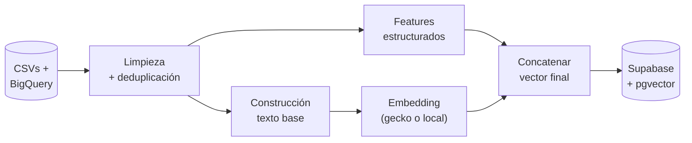
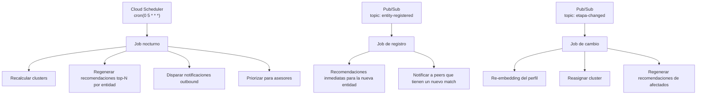

# 05 · Motor de recomendaciones

> **Aquí se gana el 55% de la nota** (30% Relevancia + 25% Agéntica).
> Este documento define las features, las dos lógicas de matching, la explicabilidad y el agente Conector.

---

## Principio guía

> Una recomendación gana cuando un asesor humano de la Cámara la ve y dice _"sí, eso tiene sentido"_.

Métricas técnicas como silhouette score son útiles para validar internamente, pero **no son el criterio del jurado**. El criterio del jurado es: _"¿esta recomendación me la haría yo si conociera a las dos partes?"_.

Por eso este motor tiene tres prioridades en orden:

1. **Legibilidad** — el cluster debe poder etiquetarse con una frase humana.
2. **Explicabilidad** — cada recomendación tiene anclas verificables y razón en lenguaje natural.
3. **Acción** — la recomendación termina en un botón que el usuario hace clic sin dudar.

---

## 1. Perfil de empresa — features

Cada `entidad_economica` (formal o informal) se convierte en un vector que combina features estructurados y un embedding semántico.

### Features estructurados

| Feature              | Tipo                         | Cómo se construye                                                        |
| -------------------- | ---------------------------- | ------------------------------------------------------------------------ |
| Sector CIIU          | One-hot encoding             | `CLUSTERS_SECTORES_SECCIONES_ACTIVIDADES.csv` define la jerarquía        |
| Etapa de crecimiento | Ordinal                      | `idea (1) < nacimiento (2) < crecimiento (3) < madurez (4)`              |
| Ubicación            | Lat/lon + dummies por barrio | Geocoding del campo `barrio` o `municipio`                               |
| Programas            | Vector binario               | Lista de programas en los que ha participado                             |
| Diagnóstico          | Numérico escalado            | Variables ordinales del diagnóstico (facturación rango, empleados, etc.) |
| Antigüedad           | Numérico escalado            | Años desde fundación                                                     |
| Tamaño               | Categórico                   | `micro · pequeña · mediana · grande` derivado de empleados/facturación   |

### Feature semántico

| Feature            | Tipo                                                                               | Cómo se construye                                                |
| ------------------ | ---------------------------------------------------------------------------------- | ---------------------------------------------------------------- |
| `embedding_perfil` | Vector dim 768                                                                     | Concatenar nombre + descripción + sector + programas → embedding |
| Modelo recomendado | text-embedding-gecko (Vertex AI) o `paraphrase-multilingual-mpnet-base-v2` (local) |

### Texto base para embedding

```text
{nombre}.
Sector: {sector_ciiu_descripcion}.
Etapa: {etapa}.
Ubicación: {barrio}, {municipio}.
Programas: {programas_lista}.
{descripcion_libre_si_existe}.
```

### Pipeline de construcción



---

## 2. Clustering — agrupar dinámicamente

### Objetivo

Generar grupos donde los miembros se parecen más entre sí que con los de otros grupos, **y donde el grupo se puede explicar en una frase**.

### Algoritmos

#### K-means

- **Cuándo**: clusters generales por sector + etapa + tamaño.
- **K**: probar `k ∈ [5, 8, 12, 15]` y elegir por interpretabilidad, no solo por inertia.
- **Inicialización**: `k-means++`.
- **Output**: centroide + miembros + etiqueta humana generada por Gemini.

#### DBSCAN

- **Cuándo**: detección de clusters por densidad geográfica (ej. _"comerciantes en el Mercado del Magdalena"_).
- **Parámetros**: `eps` calibrado en metros, `min_samples = 5`.
- **Ventaja**: no requiere especificar número de clusters; encuentra agrupaciones naturales.

#### Clustering jerárquico (opcional)

- Para visualizar dendrograma en el panel admin si sobra tiempo.

### Etiquetado humano de clusters

Cada cluster generado pasa por Gemini con este prompt:

```text
Eres un analista de la Cámara de Comercio de Santa Marta.
Te paso 14 empresas que el algoritmo agrupó. Genera una etiqueta corta
(máx 10 palabras) que describa qué tienen en común estas empresas.
La etiqueta debe ser específica, no genérica.

Ejemplos buenos:
- "Hoteles boutique en Rodadero · etapa madurez"
- "Vendedoras de almuerzos en Mercado Bazurto · informal consolidado"
- "Pescadores artesanales de Taganga · cooperativas pequeñas"

Ejemplos malos:
- "Empresas del sector turismo"
- "Negocios pequeños"

Empresas: {muestra_5_representativas}
```

---

## 3. Dos lógicas de matching

> **Esta es la distinción más importante del motor.** Un solo algoritmo no resuelve los dos casos.

### 3.1 Peer matching (similitud)

**Pregunta que responde**: _"¿Quién se parece a mí y puede ser mi referente o aliado?"_

| Aspecto           | Detalle                                                                         |
| ----------------- | ------------------------------------------------------------------------------- |
| Técnica           | Cosine similarity sobre `embedding_perfil` con boost por features estructurados |
| Cuándo aplica     | Mismo sector + etapa similar (±1) + sin solapamiento territorial agresivo       |
| Tipos de relación | `referente` (ya pasaron por lo que tú estás pasando), `aliado` (colaboración)   |
| Score             | Cosine similarity normalizado a 0–100                                           |
| Anclas típicas    | Mismo sector, mismo programa, etapa avanzada, distancia ≤ 5km                   |

#### Pseudo-algoritmo

```python
def peer_recommendations(entity_id: str, k: int = 5) -> list[Recommendation]:
    me = load_entity(entity_id)
    candidates = load_same_sector(me.sector_ciiu)
    candidates = exclude_self_and_already_connected(candidates, me)

    scored = []
    for c in candidates:
        cosine = cosine_similarity(me.embedding, c.embedding)
        stage_penalty = abs(me.etapa_ordinal - c.etapa_ordinal) * 0.05
        program_boost = 0.1 if shares_program(me, c) else 0
        score = (cosine - stage_penalty + program_boost) * 100
        anclas = build_anclas_peer(me, c)
        scored.append(Recommendation(
            target=c,
            tipo_relacion=infer_peer_type(me, c),  # referente | aliado
            score=score,
            anclas=anclas,
        ))

    return top_k(scored, k)


def infer_peer_type(me, other) -> Literal["referente", "aliado"]:
    if other.etapa_ordinal > me.etapa_ordinal:
        return "referente"
    return "aliado"
```

### 3.2 Cadena de valor (complementariedad)

**Pregunta que responde**: _"¿Quién me puede vender a mí o a quién le puedo vender yo?"_

| Aspecto           | Detalle                                                                        |
| ----------------- | ------------------------------------------------------------------------------ |
| Técnica           | Reglas heurísticas sector→sector + clasificador LLM (Gemini Flash)             |
| Cuándo aplica     | Sectores complementarios, no idénticos                                         |
| Tipos de relación | `cliente potencial`, `proveedor`                                               |
| Score             | Combinación de fuerza de la regla + proximidad geográfica + validación LLM     |
| Anclas típicas    | Cadena de valor identificada, distancia, pares conectados, capacidad declarada |

#### Tabla de reglas (versión inicial — Data/ML completa Día 1)

| Si yo soy...                    | Puedo ser proveedor de...                   | Puedo ser cliente de...                 |
| ------------------------------- | ------------------------------------------- | --------------------------------------- |
| Cocinera de almuerzos           | Oficinas, obras, eventos                    | Mercados, productores agrícolas locales |
| Hotel boutique                  | Agencias de turismo, plataformas de reserva | Lavanderías, pescadores, panaderías     |
| Pescador artesanal              | Restaurantes, hoteles, plazas de mercado    | Astilleros, ferreterías navales         |
| Artesano (mochilas, accesorios) | Tiendas turísticas, marketplaces, hoteles   | Productores de hilo, cuero, materiales  |
| Lavandería                      | Hoteles, restaurantes, gimnasios            | Suministros químicos, equipos           |
| Mototaxista                     | Empresas con domicilios, restaurantes       | Mecánicos, talleres                     |
| Tendero de barrio               | Vecinos (B2C, fuera de scope inicial)       | Distribuidores mayoristas, panaderos    |
| Panadero                        | Restaurantes, hoteles, tenderos, cocineras  | Molinos, distribuidores de harina       |
| Agencia de turismo              | Hoteles, viajeros (B2C)                     | Guías, transportadores, cocineras       |

> Esta tabla se serializa como JSON y vive en `motor/value_chain_rules.json`.

#### Pseudo-algoritmo

```python
def value_chain_recommendations(entity_id: str, k: int = 5) -> list[Recommendation]:
    me = load_entity(entity_id)
    rules = load_value_chain_rules()
    target_sectors_provider = rules.get_clients_for(me.sector_ciiu)
    target_sectors_consumer = rules.get_suppliers_for(me.sector_ciiu)

    candidates = load_entities_in_sectors(target_sectors_provider + target_sectors_consumer)
    candidates = exclude_self_and_already_connected(candidates, me)

    scored = []
    for c in candidates:
        rule_strength = rules.strength(me.sector_ciiu, c.sector_ciiu)
        proximity = geo_proximity_score(me.ubicacion, c.ubicacion)  # 0..1
        peer_validation = count_similar_pairs_connected(me, c) / 10
        score = (rule_strength * 0.5 + proximity * 0.3 + peer_validation * 0.2) * 100

        # Validación LLM: descarta combinaciones absurdas
        if not gemini_flash_validates_pair(me, c, threshold=0.7):
            continue

        tipo = "proveedor" if c.sector_ciiu in target_sectors_consumer else "cliente potencial"
        scored.append(Recommendation(
            target=c,
            tipo_relacion=tipo,
            score=score,
            anclas=build_anclas_value_chain(me, c),
        ))

    return top_k(scored, k)
```

### 3.3 Combinar las dos lógicas

El endpoint `GET /api/recommendations` con `type=all` retorna las top-K mezcladas, garantizando diversidad: máximo 2 del mismo `tipo_relacion` en el top-5.

---

## 4. Explicabilidad — cómo se gana el 30% de Relevancia

### Anclas verificables

Cada recomendación lleva un array de **anclas**: hechos verificables en los datos. La razón en lenguaje natural se construye a partir de estas anclas, no del aire.

```json
{
  "anclas": [
    {
      "tipo": "pares_conectados",
      "valor": 3,
      "detalle": "3 hoteles boutique parecidos al tuyo ya compran a esta cooperativa"
    },
    { "tipo": "distancia_km", "valor": 12 },
    { "tipo": "programa_compartido", "valor": "Ruta C Crece+" },
    { "tipo": "frecuencia_entrega", "valor": "diaria" }
  ]
}
```

### Tipos de anclas posibles

| Tipo                    | Significado                                        |
| ----------------------- | -------------------------------------------------- |
| `pares_conectados`      | N empresas similares ya conectaron con este target |
| `distancia_km`          | Distancia geográfica                               |
| `programa_compartido`   | Ambas pasaron por el mismo programa                |
| `sector_complementario` | Cadena de valor identificada                       |
| `etapa_avanzada`        | El target está más avanzado (caso `referente`)     |
| `cluster_compartido`    | Pertenecen al mismo cluster                        |
| `frecuencia_entrega`    | Capacidad declarada de servicio                    |
| `validacion_camara`     | Validado por un asesor de la Cámara                |

### Generación de la razón con Gemini

```text
SYSTEM
Eres un asesor de la Cámara de Comercio de Santa Marta. Hablas de forma cálida,
directa y específica. Nunca usas jerga técnica. Siempre justificas con hechos
del contexto que te paso. Máximo 2 frases.

USER
Te paso un par empresa→empresa y las anclas verificables.
Empresa origen: {nombre_origen} ({sector_origen}, {etapa_origen})
Empresa destino: {nombre_destino} ({sector_destino}, {etapa_destino})
Tipo de relación: {tipo_relacion}
Anclas verificables:
{anclas_json}

Genera la razón de la recomendación en español neutro de Colombia.
Empieza con un verbo en presente. No uses la palabra "porque".
```

**Ejemplo de output:**

> _"Tres hoteles boutique parecidos al tuyo ya compran pescado fresco a esta cooperativa de Taganga. Está a 12 km y entrega diariamente."_

### Caché de explicaciones

Para evitar latencia y costos en demo, las explicaciones se generan en batch durante el cron nocturno y se persisten en la tabla `recomendacion`. El frontend solo lee, nunca llama a Gemini en runtime.

---

## 5. Agente Conector — el 25% de la nota

### Qué hace

> El agente Conector es un servicio que **actúa solo**, sin que ningún usuario abra la app, y produce valor que aparece en los canales de los usuarios.

### Tres disparadores



### Disparador 1 · Cron nocturno (5:00 AM)

```typescript
// Cloud Scheduler dispara POST /api/agent/recompute con header de autenticación
// El handler en NestJS hace:

async function nightlyRecompute() {
  await recomputeAllClusters()
  const entities = await loadActiveEntities()

  for (const entity of entities) {
    const recos = await generateRecommendations(entity.id, { limit: 10 })
    await persistRecommendations(entity.id, recos)

    if (entity.origen === 'informal_registrado' && hasNewOpportunity(recos)) {
      await sendWhatsAppNotification(entity, recos[0])
    }
  }

  const priorityList = await detectEntitiesNeedingHumanAttention()
  await persistPriorityList(priorityList)

  await logEvent({
    tipo: 'nightly_recompute',
    payload: { entities: entities.length },
  })
}
```

### Disparador 2 · Nueva entidad registrada

Cuando se inserta una fila en `entidad_economica`:

1. Trigger de Postgres → publica en Pub/Sub topic `entity-registered`.
2. Cloud Run recibe el push y ejecuta:
   - Generar recomendaciones inmediatas para la nueva entidad.
   - Detectar peers existentes que ahora tienen un nuevo match potencial → notificar a esos peers.
   - Si la entidad nueva es informal con WhatsApp → mandar mensaje de bienvenida + primera oportunidad.

### Disparador 3 · Cambio de etapa

Cuando una entidad pasa de `crecimiento` a `madurez` (o cualquier transición):

1. Re-embedding del perfil (texto base cambió).
2. Reasignación de cluster.
3. Regeneración de recomendaciones para esta entidad y para los peers que ahora podrían ver a esta entidad como `referente`.

### Priorización de empresarios para asesores

El agente marca empresarios que necesitan intervención humana, con score y motivo:

| Motivo                                               | Score base |
| ---------------------------------------------------- | ---------- |
| Recibió 5+ recomendaciones y no actuó en ninguna     | 80         |
| Es target de 3+ formales que iniciaron contacto      | 70         |
| Cambió de etapa hace > 30 días sin actualizar perfil | 60         |
| Tiene cluster pero sin programa asignado             | 50         |
| Está en territorio subatendido                       | 40         |

La lista resultante aparece en el panel admin para que la coordinación asigne promotores.

### Cómo se demuestra al jurado que el agente actúa solo

1. **Logs de eventos** visibles en el panel admin: cada disparo del agente queda registrado en la tabla `evento`.
2. **Endpoint público** `GET /api/admin/agent-activity?date=today` que muestra los disparos del día.
3. **Trigger en vivo durante el demo**: registramos a Doña Marleny en escena → el panel admin muestra el evento del agente → el WhatsApp del demoer recibe el mensaje. El jurado lo ve pasar en tiempo real.

---

## 6. Cómo se conectan formales con informales — la jugada que gana el reto

> Este es el diferenciador del proyecto y el corazón del pitch.

### Una sola tabla, una sola lógica

```sql
-- Todos viven en la misma tabla
select * from entidad_economica where origen in (
  'formal',
  'informal_registrado',
  'informal_mencionado',
  'informal_autoregistrado'
);
```

El motor **no distingue** el origen al calcular similitud o cadena de valor. Las features son las mismas. Lo único que cambia es:

- **Qué información tiene la entidad** (formal tiene RUT y diagnóstico completo; informal puede no tener RUT y tener perfil más narrativo).
- **Por dónde se entrega la recomendación** (formal: web; informal: WhatsApp).

### Manejo de incompletitud

Los informales típicamente no tienen:

- CIIU formal → se infiere por descripción + LLM
- Etapa → se infiere por años de operación + tamaño
- Diagnóstico → se construye un mini-diagnóstico desde la captura por voz o el perfil de la promotora

El embedding semántico **compensa** la falta de features estructurados: el texto narrativo aporta señal aunque falten campos.

### Validación cruzada

Cuando un formal y un informal aparecen como match, el agente puede pedir validación a un asesor humano si el score es alto pero la confianza estructural es baja. Eso entra al panel admin como tarea pendiente.

---

## 7. Métricas internas para validar calidad

> No son las métricas del jurado. Son las nuestras para no autoengañarnos.

### Métricas durante construcción

| Métrica                             | Cómo se mide                                     | Umbral aceptable |
| ----------------------------------- | ------------------------------------------------ | ---------------- |
| Legibilidad de cluster              | Asesor humano puede etiquetarlo en 1 frase       | 100% de clusters |
| Coherencia de top-5 recomendaciones | Revisión humana por muestreo (10 entidades)      | 4/5 son sensatas |
| Latencia del endpoint               | p95 < 800ms                                      | OK / no OK       |
| Tasa de explicación con anclas      | % de recomendaciones con ≥ 2 anclas verificables | > 95%            |
| Diversidad de tipos de relación     | top-5 tiene al menos 3 tipos distintos           | > 80% de casos   |

### Métricas durante demo

| Métrica                            | Para qué sirve                             |
| ---------------------------------- | ------------------------------------------ |
| Conexiones generadas en vivo       | Mostrar que el sistema funciona end-to-end |
| Empresarios priorizados por agente | Mostrar que el agente actúa solo           |
| Conexiones marcadas como exitosas  | Aspiracional — proyectar a futuro          |

---

## 8. Plan B si el motor no llega

### Si Gemini falla

- Explicaciones precomputadas durante la noche y persistidas. El demo lee de DB, no llama a Gemini en vivo.
- Si Gemini falla durante la noche, el sistema cae a explicación template-based determinística (peor calidad pero funcional).

### Si pgvector no se habilita

- Similitud calculada en memoria al iniciar el motor (precompute matriz de N×N para todas las entidades activas, ~5000 max).
- El recálculo nocturno regenera la matriz.

### Si Vertex AI no está disponible

- Embeddings con `sentence-transformers` localmente (`paraphrase-multilingual-mpnet-base-v2`).
- Misma calidad para español, latencia ligeramente mayor pero aceptable para batch.

### Si el clustering K-means no converge bien

- Cluster predefinidos por sector + barrio (heurísticas), sin algoritmo. Funciona como fallback narrativo.

---

## Referencias cruzadas

- Alcance del MVP → [`01-alcance-mvp.md`](01-alcance-mvp.md)
- Quién implementa qué del motor → [`02-roles-equipo.md`](02-roles-equipo.md) (Backend/IA + Data/ML)
- A qué personas sirve → [`03-personas-y-canales.md`](03-personas-y-canales.md)
- Dónde vive este motor en la arquitectura → [`04-arquitectura.md`](04-arquitectura.md)
- Cuándo se construye cada pieza → [`06-cronograma-y-riesgos.md`](06-cronograma-y-riesgos.md)
